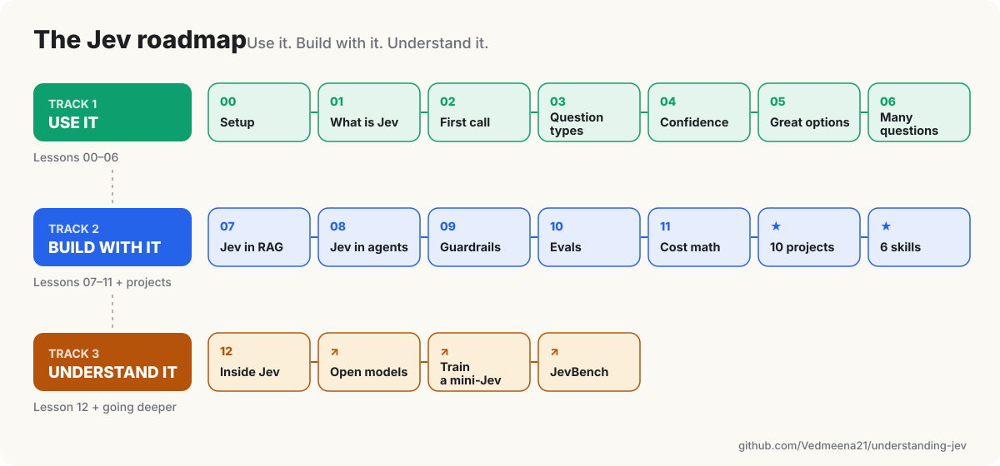
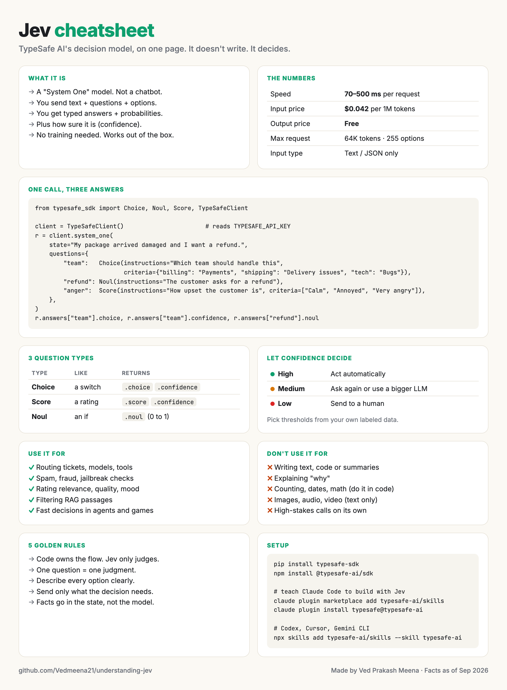

<p align="center">
  
</p>

<h1 align="center">Understanding Jev</h1>

<p align="center">
  <b>Learn it. Build with it. Understand how it works.</b><br>
  Everything about Jev, TypeSafe AI's decision model, in one place.
</p>

<p align="center">
  <a href="lessons"></a>
  <a href="projects"></a>
  <a href="skills"></a>
  <a href="LICENSE"></a>
</p>

---

## Jev in 30 seconds

- Jev is an AI model that **doesn't write**. It **decides**.
- You give it some text, a question and a few options.
- It picks one, gives every option a probability, and tells you how sure it is.
- Built by **TypeSafe AI**, founded by ex-OpenAI researcher Diogo Almeida. Launched **15 Sep 2026**.

> LLMs write. Jev decides.

---

## Why is everyone talking about Jev?

**1. It's fast.**
An LLM takes seconds. Jev answers in milliseconds.

**2. It's cheap.**
You only pay for what you send in. Everything Jev sends back is free.

**3. You can ask many questions at once.**
One email, 5 questions. All 5 come back together, in one call.

**4. It tells you how sure it is.**
Every answer comes with a confidence score, trained to be honest.
Very sure? Act on it. Not sure? Send it to a human.

**5. It can't make up an answer.**
It only picks from the options you give it. No surprise text. No broken format.

It's not magic, though. [Here's what's hype and what's real →](resources/reality-check.md)

---

## Start here

| I want to... | Go to |
|---|---|
| Understand Jev in plain words | [Lesson 01 · What is Jev](lessons/01-what-is-jev) |
| Make my first call in 10 minutes | [Lesson 00 · Setup](lessons/00-setup) → [Lesson 02 · Your first call](lessons/02-your-first-call) |
| Build something real | [Projects](projects) |
| Set up Jev in Claude Code, Codex, Cursor, MCP or LangChain | [Setup everywhere](resources/setup-everywhere.md) |
| Make my coding agent build with Jev for me | [Skills](skills) |
| See how Jev works inside | [Lesson 12](lessons/12-how-jev-works-inside) → [Train a mini-Jev](projects/advanced/mini-jev) |
| Know where Jev fits in real companies | [Use cases](resources/use-cases.md) |
| Find the best Jev repos and articles | [Repos](resources/repos.md) · [Reading list](resources/reading-list.md) |
| Get everything on one page | [Cheatsheet](assets/cheatsheet.png) |

---

## The roadmap



---

## Lessons

Short lessons. Simple words. Code you can run. A 3-question quiz at the end of each.

| # | Lesson | | # | Lesson |
|---|---|---|---|---|
| 00 | [Setup](lessons/00-setup) | | 07 | [Jev in RAG](lessons/07-jev-in-rag) |
| 01 | [What is Jev](lessons/01-what-is-jev) | | 08 | [Jev in agents](lessons/08-jev-in-agents) |
| 02 | [Your first call](lessons/02-your-first-call) | | 09 | [Guardrails and safety](lessons/09-guardrails-and-safety) |
| 03 | [Choice, Score and Noul](lessons/03-choice-score-noul) | | 10 | [Evals and tracing](lessons/10-evals-and-tracing) |
| 04 | [Confidence and thresholds](lessons/04-confidence-and-thresholds) | | 11 | [Cost and speed math](lessons/11-cost-and-speed-math) |
| 05 | [Writing great options](lessons/05-writing-great-options) | | 12 | [How Jev works inside](lessons/12-how-jev-works-inside) |
| 06 | [Many questions, one call](lessons/06-many-questions-one-call) | | | |

→ [All lessons](lessons)

---

## Projects

10 projects you can run today. Each one has sample data, so it works right away.

| | Project | What it does |
|---|---|---|
| 🟢 | [Ticket router](projects/beginner/ticket-router) | Sends support emails to the right team |
| 🟢 | [Review ratings](projects/beginner/review-ratings) | Turns reviews into "Camera 4.1 · Battery 3.2" |
| 🟢 | [Spam checker](projects/beginner/spam-checker) | Spam, scam or phishing? And why |
| 🟢 | [Comment moderator](projects/beginner/comment-moderator) | Keep, hide or reply to YouTube comments |
| 🟡 | [Model router](projects/intermediate/model-router) | Sends each prompt to the cheapest model that can handle it |
| 🟡 | [Document classifier](projects/intermediate/doc-classifier) | Labels documents with no training |
| 🟡 | [Log triage](projects/intermediate/log-triage) | Turns error logs into an on-call summary |
| 🔴 | [Context compactor](projects/advanced/context-compactor) | Shrinks agent memory without losing what matters |
| 🔴 | [Snake bot](projects/advanced/snake-bot) | Jev plays Snake, one move at a time |
| 🔴 | [Mini-Jev](projects/advanced/mini-jev) | Train your own tiny decision model on a laptop |

→ [All projects](projects)

---

## Skills for your coding agent

6 skills that teach Claude Code, Codex, Cursor and others to build with Jev.

```bash
# Claude Code
claude plugin marketplace add Vedmeena21/understanding-jev
claude plugin install jev-skills@vedmeena21

# Codex, Cursor, Gemini CLI and others
npx skills add Vedmeena21/understanding-jev
```

| Skill | Ask it to... |
|---|---|
| `jev-design` | Turn a decision in plain English into Jev questions and code |
| `jev-audit` | Find LLM calls in your code that should be Jev calls |
| `jev-options` | Fix weak options so answers get more accurate |
| `jev-threshold` | Pick confidence thresholds from your data |
| `jev-eval` | Compare Jev with your current LLM |
| `jev-migrate` | Rewrite one LLM call into a Jev call |

→ [About the skills](skills)

---

## One call, three answers

```python
from typesafe_sdk import Choice, Noul, Score, TypeSafeClient

client = TypeSafeClient()  # reads TYPESAFE_API_KEY

response = client.system_one(
    state="My package arrived damaged and I want a refund.",
    questions={
        "team": Choice(
            instructions="Which team should handle this",
            criteria={
                "billing": "Payments, invoices, charges",
                "shipping": "Delivery, damaged or lost packages",
                "technical": "Bugs or app problems",
            },
        ),
        "wants_refund": Noul(instructions="The customer asks for a refund"),
        "anger": Score(instructions="How upset the customer is", criteria=["Calm", "Annoyed", "Very angry"]),
    },
)

print(response.answers["team"].choice)        # shipping
print(response.answers["team"].confidence)    # how sure, 0 to 1
print(response.answers["wants_refund"].noul)  # chance it's a yes, 0 to 1
```

---

## Cheatsheet

<a href="assets/cheatsheet.png"></a>

Everything on one page. Save it. Share it.

---

## What's in this repo

```
understanding-jev/
├── lessons/        13 lessons, each with code and a quiz
├── projects/       10 runnable projects: beginner, intermediate, advanced
├── skills/         6 agent skills for Claude Code, Codex, Cursor and more
├── resources/      setup everywhere, best practices, use cases, reality check, repos, reading
└── assets/         hero GIF, roadmap, cheatsheet (and how they were made)
```

---

## Contributing

Found a mistake? Built something with Jev? Know a great article?
Open an issue or a pull request.

---

<p align="center">
  Made by <a href="https://www.linkedin.com/in/ved-prakash-meena/">Ved Prakash Meena</a>. Follow for more AI resources.<br>
  <sub>Not affiliated with TypeSafe AI. Facts as of September 2026.</sub>
</p>
