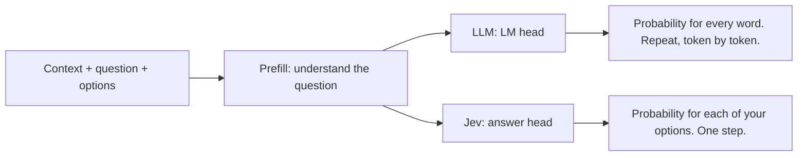

# Understanding Jev

A new AI model that **doesn't write**.
It **decides**.

Fast. Cheap. And it tells you how sure it is.

This repo explains Jev in simple words.
Short lines. Real examples. No heavy math.

---

## Contents

1. [What is Jev? Why Jev?](#1-what-is-jev-why-jev)
2. [Benefits of Jev](#2-benefits-of-jev)
3. [Impact of Jev](#3-impact-of-jev)
4. [Industry use cases](#4-industry-use-cases)
5. [Build your first Jev app](#5-build-your-first-jev-app)
6. [How Jev works inside](#6-how-jev-works-inside)
7. [Downsides of Jev](#7-downsides-of-jev)
8. [What happens next](#8-what-happens-next)

---

## 1. What is Jev? Why Jev?

### The simple answer

Jev is a new AI model by **TypeSafe AI**.

But new AI models come out every week.
So what's special here?

**Jev is not an LLM.**

- Almost every model you hear about is an LLM (Large Language Model).
- An LLM **generates text**.
- Token by token. Word by word.
- Like ChatGPT typing out a reply.

**Jev can't generate text.**
That's the biggest difference.

### Then what is Jev?

> Jev is an AI model built to make fast, structured decisions that software can use directly.

In simple words, Jev is a **decision model**.

In machine learning words, it's a **classifier**.
Just like logistic regression is a classifier.

One big difference:

- Logistic regression has to be trained on your data.
- Jev doesn't.
- It's already trained on a massive amount of data.
- It's a **generalized** model.
- Ask it any question. Give it options. It classifies.

### Let me explain with an example

You run a support chatbot.
A customer writes:

> "My package arrived damaged and I want a refund."

You send Jev 3 things:

| What you send | Example |
|---|---|
| **Context** | The customer's message |
| **Question** | Which team should handle this? |
| **Options** | Billing / Shipping / Technical / General |

Jev instantly replies: **Shipping.**

Think about it:

- Did you train Jev on your data? **No.**
- You gave it English context.
- An English question.
- And 4 options.
- It picked the most logical one.

How?

- Jev gives every option a **probability**.
- The option with the highest probability wins.
- That's your classification.

### Why Jev? "An LLM can do this too"

True.

- Give an LLM the same context.
- Same question. Same 4 options.
- Use structured output.
- It will also answer: Shipping.

So why Jev?

Because you get **2 big benefits**:

1. **Speed.** Jev is much faster than the big LLMs.
2. **Cost.** Jev is much cheaper.

Same level of decision making.
Way faster. Way cheaper.

That's why everyone is talking about it.

---

## 2. Benefits of Jev

### Benefit 1: Speed

| Model | Time for one decision |
|---|---|
| A typical LLM | ~3 to 30 seconds |
| Jev | **70 to 500 milliseconds** |

A side-by-side test.
Same billing email sent to both models:

> "Hi, we were charged twice for our May invoice and the second charge still hasn't been refunded. Can someone look into this today?"

| Run | GPT-5 | Jev | Jev is faster by |
|---|---|---|---|
| 1 | 6.58 s | 472 ms | ~13x |
| 2 | 4.19 s | 781 ms | ~5x |

- Both gave the right answer: **Billing**.
- Run it a few times and take an average.
- Jev wins every time.

### Benefit 2: Cost

Price per 1 million tokens:

| Model | Input | Output |
|---|---|---|
| GPT-5 | $1.25 | $10 |
| Jev | **$0.042** | **Free** |

Yes. Output tokens on Jev are **free**.

Let's do the math.

- You classify **10,000 support emails a day**.
- Each email is ~1,000 input tokens.
- The LLM writes back ~200 output tokens.

| Model | Per day | Per year |
|---|---|---|
| GPT-5 | ~$32 | ~$11,900 |
| Jev | **~$0.42** | **~$153** |

Jev is **~77x cheaper**.
Less than $15 a month.

So the positioning is clear:

- Same decisions as an LLM.
- Much faster.
- Much cheaper.

And there's more.

### Benefit 3: Ask many questions at once

With an LLM, you usually ask **one question at a time**.

With Jev, you ask **many questions on the same context**.
In **one API call**.

Same email: *"My package arrived damaged and I want a refund."*

| Question | Options |
|---|---|
| Which queue? | Billing / Shipping / Technical / General |
| Is it urgent? | Yes / No |
| Is a refund requested? | Yes / No |
| How angry is the customer? | 1 to 5 |
| What language is it in? | English / Hindi / Other |

- 5 questions. 1 call.
- All 5 are answered **in parallel**.
- Takes the same time as 1 question.
- Adding questions doesn't add wait time.
- No real limit on how many you ask.

Ask the same 5 questions to an LLM:

| Model | 5 questions |
|---|---|
| LLM | ~7 seconds |
| Jev | ~130 ms |

### Benefit 4: A confidence score you can trust

Every answer comes with a **confidence score**.

Example:

- Jev says: this email is about **Shipping**.
- Shipping got the highest score: **0.71**.
- Plus, Jev tells you how confident it is in the whole classification.

The best part?

- Jev is trained to be **honest** about its confidence.
- The technique is called **RLCD**.
- Reinforcement Learning for Calibrated Decisions.
- If Jev says **"I'm 90% sure"**, it's right about **90% of the time**.

LLMs are known to **fake** their confidence.
A lot of work went into making sure Jev doesn't.

#### How to picture it

- X-axis: the confidence the model **says**.
- Y-axis: how often it's **actually right**.
- The ideal is a straight diagonal line.
- Said 80% → right 80% of the time.
- Jev aims to sit right on that line.

#### How to use it in your code

| Confidence | What your app does |
|---|---|
| **Above 90%** | Trust it. Forward the email to Billing. |
| **60% to 90%** | Ask a follow-up question first. |
| **Below 60%** | Send it to a human to review. |

Your app's logic is decided by the score.
You can't do this reliably with an LLM.

### Benefit 5: It can't make up an answer

Big problem with LLMs:
They sometimes give answers that aren't right.

With Jev, that's **not possible**.

- Jev only picks from **your** options.
- Ask: *What is the capital of India?*
- Options: Mumbai / Chennai / Delhi / Kolkata
- It picks one of those 4. **Delhi.**
- It won't say *"The capital of India is New Delhi."*
- It won't invent a 5th option.

Ask an LLM which category an email belongs to.
It might reply:

- *"Returns and Refunds"* (you only offered "Refund")
- A JSON you didn't ask for
- *"This looks like it could be shipping or billing"*

Yes, there are ways to control this.
Like structured output.
But it's not 100% guaranteed.
Especially with smaller models.

With Jev:

- You get a probability for every option.
- Pick the highest one.
- Done.
- No regex. No parsing. No plumbing.

### Summary: 5 benefits

1. **Fast** decision making
2. **Cheap**
3. **Many questions** in one call
4. A **confidence score** you can rely on
5. It **can't make up** an answer

---

## 3. Impact of Jev

Now we have a model that makes **fast, cheap, accurate** decisions.
What changes in software? In AI?

Before that, 2 questions:

- **Who** built Jev?
- **Why** did they build it?

Answer these and the impact makes sense.

### Who built Jev?

- **Diogo Almeida**.
- Ex-OpenAI researcher.
- A key member of the team that brought ChatGPT.
- Worked on **InstructGPT** and **RLHF**.
- Left OpenAI and started **TypeSafe AI**.
- The company ran in **stealth mode** for about 2 years.
- Nobody knew what they were building.
- Launched Jev on **15 September 2026**.

### Why did he build it?

His point:

> Models have been superhuman at chat for years.
> So where is all the automation?

- We made LLMs very good at **chatting with humans**.
- But chatting with humans ≠ talking to **machines and APIs**.
- Today's LLMs are optimized for humans.
- Not for software.

That's why:

- AI automation isn't reliable yet.
- Demos work, but fail in production.
- Great automation software isn't getting built.

TypeSafe's answer:

> Software needs **System 1** thinking.
> But we keep building **System 2**.

### System 1 vs System 2

From the book ***Thinking, Fast and Slow*** by **Daniel Kahneman**.

Your brain works in 2 modes:

| | System 1 | System 2 |
|---|---|---|
| Mode | Fast | Slow |
| How | Quick decision | Deep reasoning |
| Example | You're riding a bike. A car comes at you. You swerve. | *"Where do I want my career in 5 years?"* |
| Thinking | Very little | A lot: where am I, what do I like, what's the market |

- Today's LLMs are **System 2** models.
- They reason. Make a plan. Then answer.

But a lot of software doesn't need that much thinking.
It needs **fast decisions**:

- An email came in. Billing, refund, or support team?
- A question came in. Which AI model should handle it?
- An agent has 10 tools. Which one fits this task?

No deep reasoning needed here.

The problem?

- We've been putting **LLMs** in all these places.
- LLMs are slow, deep thinkers.
- More time. More tokens. More cost.
- We use System 2 where we need System 1.

**Jev fixes exactly this pain point.**
Understand this one line, and you understand why Jev matters.

### Impact 1: AI moves from a feature to a primitive

Today, you see this everywhere:

- *"We added AI to our software."*
- *"This is an AI-enabled feature."*
- AI gets its own spotlight.

Why? Because adding AI to running software is **tricky**:

- Slow calls
- Token costs
- Parsing the output

With models like Jev:

- Decisions become fast and cheap.
- AI becomes a **primitive**.
- It gets treated like a simple **if-else statement**.

In the future, your code could look like this:

```python
# the idea (pseudo-code)
if is_customer_angry(email).confidence > 0.9:
    escalate_to_manager(email)
```

Today, you can't do this easily:

- Write proper code.
- Call an LLM.
- Pull out the answer.
- Then act on it.
- Slow. And you keep watching the cost.

All of that goes away once models like Jev go mainstream.

In simple words:

> AI will stop being the product.
> It will start being the plumbing.

### Impact 2: Where you'll see it

**1. AI agents**

- Agents make a lot of decisions.
- Which tool to use?
- Which model to use?
- Is this step safe or not?
- Put Jev there instead of an LLM.
- Your agent gets faster and cheaper.

**2. Business operations**

- **Support triage:** which team gets this email?
- **Refund claims:** refund or not?
- **Invoices:** real or fake?
- **Lead scoring:** will this lead pay us?

**3. Trust & safety**

- **Content moderation:** thousands of comments on a video. Which ones are abusive or unsafe? Check and remove in real time.
- **Fraud detection**
- **Spam detection**
- **Prompt safety:** every prompt goes to Jev first. Is it a jailbreak? A prompt injection? Checked **before** the LLM even sees it.

**4. Unstructured data**

- Website logs → what's going on here?
- Product catalogs → instant categories.
- Tickets and call transcripts → sorted in seconds.

**5. Real-time systems**

- **Games:** a car game. Go left or right? That's a decision. An LLM would crash the car while thinking.
- **Live UI:** search thousands of products for one attribute. Matching products pop up instantly. Because the backend is fast.

### Impact 3: LLMs + Jev work together

Don't think *"Jev is here, nobody needs LLMs now."*

- Writing an essay → LLM
- Chatting → LLM
- Generating a video → LLM
- The **small decisions inside** → Jev

Complex reasoning → LLMs.
Small decisions → Jev.
**Both work together.**

### One limitation to remember

Jev is a System 1 model.
That means **it's not very intelligent**.

It's a trade-off. Same as your brain:

- Decide fast → you can make mistakes.
- Think more, fewer mistakes → takes more time.

| | Jev | LLM |
|---|---|---|
| Speed | Fast | Slow |
| Intelligence | Can't fully rely on it | Can rely on it |

Deciding **where to use which one**?
That's your main job as an AI engineer.

### Questions people ask

**Q: Can I use Jev for agentic routing of a query instead of an LLM, by giving it vector store info? It would reduce LLM calls.**

- **Absolutely.** Tailor-made use case.
- Routing isn't a hard or complex task.
- Decision models like Jev can easily do it.

**Q: My agent has a task that needs planning and then doing. Where does Jev fit?**

| Step | Who does it |
|---|---|
| Planning | LLM |
| What arguments to send to tools | LLM |
| Which tool to select | **Jev** |
| Before every step: is this right? Is it safe? | **Jev** |

- Small decisions in the agentic workflow → Jev.
- Heavy lifting → still the LLM.

**Q: I'm building an agentic RAG system. Can Jev decide between retrieval, web search, or answering from internal knowledge?**

- **Yes.**
- It's a small decision.
- No need to use an LLM for it.

In simple words:

- **Harness engineering** = the whole system you build around an LLM.
- Jev becomes a big part of that.
- Teams will start asking: *"Why is there an LLM here? Put Jev here."*

---

## 4. Industry use cases

What are people already building with Jev?
Here are the best demos.

### Context compaction

- **Context** = the working memory of an LLM.
- As the chat gets longer, context fills up.
- The model's reasoning and answer quality drop.
- Fix: **compact** the context.
- Drop what's useless. Summarize what's important.
- Jev goes through the context and decides: **useful or not?**

Sounds easy.
Ask anyone who has studied context engineering.
It's a **hard** task.

Libraries that use Jev under the hood to do this are coming.

### Browser use / computer use

- Tell an agent: *"Book me a flight ticket."*
- It opens the browser, types the cities, picks the date, books it.
- With LLMs, this is **very slow**. They think a lot.
- With Jev: book a flight **Zurich → London**.
- Done in about **7 seconds**. In real time. Not sped up.
- Browser use = lots of small decisions. Perfect for Jev.

### AI slop detector for LinkedIn

- Scrolling LinkedIn is tiring.
- A lot of posts are written by LLMs for engagement.
- Most of it is **AI slop**.
- A browser plugin sends each post in your feed to Jev.
- Question: *Is this AI slop or not?*
- If yes → a **red banner** on the post.
- You don't have to read it.

That's the **live UI** example.
The UI changes in real time, because Jev is fast.

### Real-time trading

- People are running trades in real time with Jev.
- Could be very risky.
- But people are doing it.

### Playing games

- **Subway Surfers:** go left, go right, jump on the train, duck.
- **Super Mario**
- Games = quick decisions = System 1 thinking.
- Jev is fast enough to actually play.

### Real-time ad blocker

- A site full of ads loads. Like speedtest.net.
- Page components go to Jev.
- *Is this an ad?*
- The ads get removed.
- A great example of **JavaScript + Jev**.

### More demos

- **Email sorting:** ~1,500 emails classified in seconds.
- **Lead generation**
- **Talking to databases**
- **Research papers:** ~1,000 papers categorized. Very cheap. Very fast.
- **Model router:** which model should answer this prompt?
- **Job matching:** a candidate matched 400 companies against their skills and resume. For very little money.

### Ideas from TypeSafe themselves

- Search and retrieval
- Scientific discovery
- Model routing
- Guardrails for LLMs
- Recruiting
- Lead generation

Pick any one idea. Apply Jev to it.

Want more? Search **"Jev"** on X or GitHub.
People are building really cool stuff.

### Questions people ask

**Q: Jev is text-only. So how are these game and website demos working?**

- Right now Jev is **not multimodal**.
- People are passing context **as text**.
- Game → the current game state, written as text.
- Website → the current page, converted to text or code.
- Not real-time video. Not images.
- That text goes to Jev as context.

**Q: Isn't it just a classifier model?**

- **Yes, it is.**
- But a **generalized** classifier.
- It has knowledge of the whole world.
- You don't fine-tune it for your use case.
- **That's the biggest USP.**

Classifiers existed before.
Remember how we built them in machine learning?

| Old classifiers | Jev |
|---|---|
| Collect your data | Send your question |
| Feature engineering | Send your options |
| Train the model | Get the answer |
| Then predict | |

**Classification as a service.**

**Q: Is there an Indian competitor?**

- **Yes: Laya.**
- Built by **Nandakishor Mukkunnoth**.
- Its core model came out much earlier.
- He built a non-autoregressive decision model with RL.
- Published a research paper back in **March 2025**.
- Has its own dataset. Open source.
- Then a frontier lab launched the same idea and it was called a breakthrough.
- He wrote a frustrated blog about it.
- Laya works almost the same way.
- Jev got more attention because its founder came from OpenAI.
- The long race will decide.

---

## 5. Build your first Jev app

Let's build something real.
So you see how to use the API yourself.

### The idea

Open any phone on an online store.
Go to the reviews.

You'll see ratings **per feature**:

| Feature | Rating |
|---|---|
| Camera | 4.6 |
| Battery | 4.1 |
| Display | 4.8 |
| Design | 4.7 |

To build this, a store's data science team would most likely:

- Train their own NLP model on their data, **or**
- Fine-tune a model like **BERT**.

With Jev:

- **No** training.
- **No** fine-tuning.
- Incredibly fast.

### Setup

1. Go to the **TypeSafe AI** website and sign in.
2. Open the **Playground**. Send a state, a question and options. See the answer.
3. Go to **API Keys**. Create a new key.
4. Install the SDK:

```bash
pip install typesafe-sdk
export TYPESAFE_API_KEY="your-key"
```

### The data

- A CSV file with **50 reviews** of one phone.
- Each row: a star rating + the review text.

### The questions

7 features:

1. Camera
2. Battery
3. Display
4. Design
5. Performance
6. Build quality
7. Value for money

For **each** feature, ask **2 questions**:

1. Does the review talk about this feature? **(yes / no)**
2. If yes, how satisfied is the reviewer with it? **(a scale)**

7 features × 2 = **14 questions**.
Sent together. On **one** review. In **one** call.

### The code

```python
from typesafe_sdk import Noul, Score, TypeSafeClient

client = TypeSafeClient()  # reads TYPESAFE_API_KEY

features = {
    "camera": "the camera, photos or videos",
    "battery": "battery life or charging",
    "display": "the display or screen",
    "design": "the design or looks",
    "performance": "speed, lag or gaming performance",
    "build_quality": "build quality or durability",
    "value_for_money": "price and value for money",
}

questions = {}
for name, about in features.items():
    questions[f"{name}_mentioned"] = Noul(
        instructions=f"The reviewer gives an opinion or experience about {about}",
    )
    questions[f"{name}_satisfaction"] = Score(
        instructions=f"How satisfied the reviewer is with {about}",
        criteria=["Very unhappy", "Unhappy", "Neutral", "Happy", "Very happy"],
    )

review = "Camera is great in daylight but battery barely lasts a day."

response = client.system_one(state=review, questions=questions)

THRESHOLD = 0.5  # below this, Jev isn't sure. Ignore it.

for name in features:
    mentioned = response.answers[f"{name}_mentioned"].noul
    if mentioned > THRESHOLD:
        print(name, response.answers[f"{name}_satisfaction"].score)
```

What's happening:

- `state` = the context. Here, one review.
- `questions` = all 14 questions.
- `Noul` = a yes/no question.
- `Score` = a question on a scale.
- The threshold is the **confidence score** idea in action.
- Above 0.5 → a valid answer.
- Below 0.5 → Jev isn't sure. Skip it.

Now:

1. Loop over all 50 reviews.
2. Collect the answers.
3. Average them per feature.

### The output

You get something like this:

```
Overall          3.2
Camera           3.0   (mentioned in 12 reviews)
Battery          3.5   (mentioned in 15 reviews)
Display          3.7   (mentioned in 16 reviews)
...
```

- Same thing the online store shows.
- Click **Camera** → show the 12 reviews that talk about the camera.
- Even show the exact line where the camera is mentioned.
- Run it in real time. Or store the results.

**~100 lines of code.**
**Built in under half an hour.**

This is why TypeSafe calls Jev the **if-else of the AI world**.

---

## 6. How Jev works inside

Now the interesting question:

- How does Jev do all this behind the scenes?
- What's the architecture?
- Why isn't it an LLM?

**Disclaimer first:**

- TypeSafe has shared **nothing** about the architecture.
- No paper. No dataset. No methodology.
- Even the most closed-source LLMs share more.
- Just a few statements on their website.

So here's what we'll do:

1. Collect those statements.
2. Connect the dots.
3. Imagine what the architecture could be.

This might turn out to be **completely wrong** once they publish.

And you **don't need** this to use Jev.
Using Jev = calling an API + your judgment.
But if you're curious, let's go.

### What we know: 8 clues

1. **Transformer-based.** Guaranteed. But encoder (like BERT) or decoder (like GPT)? Unknown.
2. **Broad world knowledge.** Not written on the website, but you can ask it about anything. So world knowledge is in its weights. Just like LLMs.
3. **Built for System 1 tasks.** Not a super intelligent model. You can't compare it with 500B to 1000B parameter models.
4. **Trained on synthetic data.** Not real-world data. Data generated by some other AI model, maybe.
5. **Non-autoregressive.** LLMs generate text token by token. Jev doesn't.
6. **Schema-constrained output.** 4, 5 or 10 options, whatever you give, it answers from those only.
7. **Parallel sampler.** Ask many questions on one context. All answered in parallel. More questions don't add time or cost.
8. **Calibrated confidence (RLCD).** Every answer comes with a confidence number, trained to be honest.

A quick note on RLCD:

| | RLHF | RLCD |
|---|---|---|
| Full form | RL from Human Feedback | RL for Calibrated Decisions |
| Makes the model... | Better at chatting the way humans like | Honest about how sure it is |

Now let's backtrack from these 8 clues.

### Encoder or decoder?

It **looks** like an encoder (BERT):

- It does classification.
- BERT is a classifier too.

But it's **not** BERT:

- BERT has to be fine-tuned for each task.
- Jev is already trained on world knowledge.

The clue that settles it:

- An independent blog ran ~**10,000 API calls** on Jev.
- Tested it on **MMLU** (a world-knowledge exam for AI models).
- Jev scored ~**84.6%**.
- That means very good world knowledge.
- That needs **pre-training on a huge amount of data**.
- Pre-training at that scale happens in **decoders**.
- Like the GPT family. Claude. Almost every top LLM today.

**Conclusion 1: Jev is a decoder-based transformer.**
Just like any other LLM.

But wait.
Decoders are **autoregressive** by nature.
Jev isn't.
How?

### How an LLM answers: 2 stages

**Stage 1: Prefill**

- Your question goes into the LLM.
- Through its many neural network layers.
- It becomes vectors (keys and values).
- Goal: **understand the question**, using everything the model knows.

**Stage 2: Decode**

- Now it writes the answer. **Token by token.**
- Question: *What is the capital of India?*
- `The` → `capital` → `of` → `India` → `is` → `New` → `Delhi` → `.`
- Each word, the whole response goes back in again.

How does it pick each word?

- The last layer is the **LM head** (language modeling head).
- It gives a probability to **every word** in the vocabulary.
- *"New"* gets the highest → pick it.
- Repeat. Now *"Delhi"* gets the highest → pick it.
- A **softmax** turns scores into probabilities between 0 and 1.

### What Jev (probably) does

- **Prefill stays the same.** Jev still understands your question.
- **Decode is different.**
- They removed the LM head.
- Replaced it with their own **answer head**.
- It doesn't score every word in the language.
- It scores **only your 4 options**.
- Softmax over those 4 → probabilities that add up to 1.
- One step. No word-by-word loop.

**That's why it's non-autoregressive.**
**That's why it's fast.**
**That's why the output sticks to your options.**



On top of that, Jev generates a **confidence score**:
How confident is the model in this answer?
That comes from training.

### How Jev was (probably) trained

Most likely:

1. Take an **open-source pre-trained model**. For example, a **Qwen** model.
2. Keep only the layers used in **prefill**.
3. Replace the decoding layers with their own **answer head**.
4. **Training 1:** synthetic data. *Here's a question. Here are the options. Pick the right one.* Learn to give the right probabilities.
5. **Training 2: RLCD.** More synthetic data. The more truthful the confidence, the bigger the reward. Lie about it, get penalized.

They didn't re-teach world knowledge.
The open-source model already had it.

Could they have pre-trained their own model?
Yes, if they had the money.
Then it would be 3 training stages instead of 2.

But my bet is **2 stages**. Why?

- They say they used **only synthetic data**.
- Pre-training needs real data from the whole world.
- Only synthetic data → no pre-training → they started from an existing model.

### How parallel questions (probably) work

Say you have **1 context** and **4 questions**.

- Context + Question 1 → prefill
- Context + Question 2 → prefill
- Context + Question 3 → prefill
- Context + Question 4 → prefill

All at the **same time**.

- Question 1 doesn't know what's in Question 2.
- Each pair is processed **independently**.
- Then each one is decoded.

So their prefill stage might be a bit different too.

### Architecture in a nutshell

| Clue | Explained by |
|---|---|
| Transformer | Decoder-based, like other LLMs |
| World knowledge | Starts from a pre-trained model |
| Built for System 1 | That base model isn't a giant one |
| Synthetic data | Used to train the new answer head + RLCD |
| Non-autoregressive | LM head replaced with an answer head |
| Schema-constrained output | The answer head only scores your options |
| Parallel sampling | Context + each question prefilled side by side |
| Calibrated confidence | RLCD |

**A decoder-based transformer that is non-autoregressive.**
That's the summary.

### Questions people ask

**Q: How exactly does RLCD penalize a wrong confidence score?**

- **Can't say.**
- There's a metric called the **Brier score**.
- It punishes confident wrong answers.
- But how the metric is set up, what synthetic questions they used, and how the rewards work in the RL algorithm?
- Not published.
- We can only talk at a high level.

---

## 7. Downsides of Jev

So far we've only praised Jev.
Let's talk about the problems too.

**1. No proof for the numbers yet**

- TypeSafe says: **40 to 200x faster**, **20 to 100x cheaper**.
- These are their own numbers.
- No third-party benchmarks yet.
- They're slowly coming. Like **JevBench**.
- It tests 4 things: **intelligence, calibration, speed, cost**.
- Test on these 4 → LLMs go down, decision models like Jev go up.
- Many Jev copies are already on its leaderboard.
- Some are built on small **4B** parameter models.
- Easy to build: take a pre-trained model, change the decode stage, train on synthetic data. Not very costly.

**2. Text only**

- You can only send text.
- No videos, photos or audio.
- They've said multimodal is coming.

**3. No web search**

- It can't search the web.
- It only knows what it learned in training.
- Ask about anything after its cutoff → no good answer.

**4. No explanation**

- It doesn't tell you **why** it picked an answer.
- No reasoning tokens.
- No explainability.
- Just an answer + a confidence score.
- You can't use it in a bank setup.
- Use it for small things.

**5. Not very intelligent**

- People have published its known weak spots.
- It makes mistakes.
- Fast, cheap, quick decisions. Yes.
- Super intelligent? No.

**6. Closed source**

- No paper. No dataset. No methodology.
- Everything is hidden.
- Just a website and an API.
- They'll probably have to change this.
- Or open source and frontier labs like OpenAI and Anthropic will catch up.

---

## 8. What happens next

What could happen in the next 6 months, 1 year, 2 years?
My predictions. I might be wrong.

**1. Everyone will copy it**

- Jev is famous now.
- People can see the problem it solves.
- Many copies already exist.
- **Laya** was there even before, with a paper and a dataset.
- Expect OpenAI and Anthropic to release their own.
- Many open-source alternatives are coming.

**2. Big platforms will use it inside**

- It's a decision model. It fits everywhere.
- Cloud platforms like AWS or Vercel may use models like Jev behind the scenes.
- As a programmer, you won't even know.
- Adoption at that level will be very high.

**3. It won't replace LLMs. They'll work together.**

> A big model plans.
> Cheap decision models run every step in between.

- You'll see this architecture everywhere.
- In RAG apps: Jev in many places, LLM does the heavy lifting.
- In AI agents.
- In normal software.

**4. Tools will be built around it**

- Is Jev doing its work properly?
- How fast?
- How many mistakes?
- **LangSmith** already supports tracing Jev.
- This tooling layer will keep growing.

**5. A new job title: decision engineer**

Someone whose job is to keep asking:

- Where can we put decision models?
- What thresholds should we set?
- How do we handle those thresholds?
- What options should we give for each decision?

Maybe a new specialized role in the AI engineering stack.

**6. Multimodal and web search**

- Text only today.
- Multimodal soon.
- Web search soon.

**7. A completely new class of software**

- It's so cheap, people will use it **everywhere**.
- A decision on **every interaction** you have with software.
- What are you typing? How long are you taking?
- Quick decisions on all of it.
- Your software won't get slow.
- You won't pay much to run those decisions.

### Final thought

For me, Jev is a **milestone**.
Just like ChatGPT was.

- Before: we used LLMs for decisions. Slow. Expensive.
- Now: decision making is **unlocked**.
- People will keep finding small decisions that make software better.
- And the user experience better.

There's a completely new shift happening in AI.
That's why people are going crazy about it.

**This isn't noise.**
**It's signal.**

---

Made by [Ved Prakash Meena](https://www.linkedin.com/in/ved-prakash-meena/). Follow for more AI resources.
