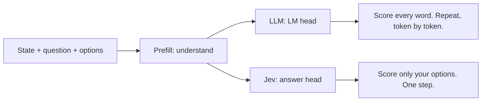

# 02 · How Jev works

[← 01 · What is Jev](01-what-is-jev.md) · Next: [03 · Setup →](03-setup.md)

---

## The shape of every call

```
state (your text or JSON)
   +
questions (each with a type and options)
   ↓
Jev
   ↓
answers (typed values + probabilities + confidence)
```

That's it. Every Jev call looks like this.

---

## 1. State

The **state** is the context Jev reads.

- A support ticket
- An email
- A product listing
- A game screen, written as JSON
- The last 20 tool calls of your agent

It can be **plain text** or **nested JSON**.

TypeSafe's advice:

- Prefer **JSON over one long string**.
- Send **only what the decision needs**.
- Put facts from your database **in the state**. Don't rely on what the model remembers.

---

## 2. The 3 question types

| Type | Think of it as | Use it for | You get back |
|---|---|---|---|
| **Choice** | a `switch` / enum | Pick one of N options (up to 255) | `.choice`, `.probabilities`, `.confidence` |
| **Score** | sorting / a threshold | Rate on an ordered scale (2 to 10 levels) | `.score`, `.probabilities`, `.confidence` |
| **Noul** | an `if` | A yes/no question | `.noul` (probability from 0 to 1) |

"Noul" comes from **Bernoulli**, a yes/no probability.

### Choice

> Which team should handle this?
> billing / technical / sales

```python
Choice(
    instructions="Which team should handle this",
    criteria={
        "billing": "Payments, invoicing, refunds",
        "technical": "Bugs, outages, integrations",
        "sales": "Pricing, upgrades, new accounts",
    },
)
```

- Each option gets a short description.
- Good descriptions matter more than the question text.

### Score

> How frustrated is the customer?
> Calm → Frustrated → Very angry

```python
Score(
    instructions="How frustrated is the customer",
    criteria=["Calm", "Frustrated", "Very angry"],
)
```

- Levels go from lowest to highest.
- The score lands on that scale: `1.05` means "about level 1" (Frustrated).

### Noul

> Does this message convey urgency?

```python
Noul(instructions="The message conveys urgency or time-sensitivity")
```

- Returns a probability.
- `0.95` = very likely yes.

---

## 3. A real request and response

Request (HTTP):

```json
POST https://api.typesafe.ai/v1/systemone

{
  "state": "Help! My payouts have been failing for 3 days.",
  "model": "jev-latest",
  "questions": {
    "is_urgent": {
      "type": "noul",
      "instructions": "Does this convey urgency?",
      "criteria": { "true": "Explicitly time-sensitive", "false": "No urgency expressed" }
    },
    "department": {
      "type": "choice",
      "instructions": "Which team should handle this?",
      "criteria": {
        "billing": "Payments, invoicing, refunds",
        "technical": "Bugs, outages, integrations",
        "sales": "Pricing, upgrades, new accounts"
      }
    },
    "frustration": {
      "type": "score",
      "instructions": "How frustrated is the customer?",
      "criteria": ["Calm", "Frustrated", "Very angry"]
    }
  }
}
```

Response:

```json
{
  "model": "jev-1.13.0",
  "answers": {
    "is_urgent":   { "type": "noul", "noul": 0.95 },
    "department":  {
      "type": "choice",
      "choice": "billing",
      "probabilities": { "billing": 0.88, "technical": 0.12, "sales": 0.0 },
      "confidence": 0.81
    },
    "frustration": {
      "type": "score",
      "score": 1.05,
      "legend": { "0": "Calm", "1": "Frustrated", "2": "Very angry" },
      "probabilities": { "0": 0.0, "1": 0.95, "2": 0.05 },
      "confidence": 0.92
    }
  },
  "usage": { "input_tokens": 304, "output_tokens": 18 }
}
```

Source: [TypeSafe API reference](https://docs.typesafe.ai/api.md)

---

## 4. Confidence: the most useful number

Every Choice and Score answer comes with a **confidence**.

- Jev is trained to make it **honest**.
- If it says 80% sure, it should be right about 80% of the time.
- That's called being **calibrated**.

Use it to decide what your code does:

| Confidence | What your app does |
|---|---|
| High | Act on it automatically |
| Medium | Ask a follow-up question, or use a bigger model |
| Low | Send it to a human |

TypeSafe's own rule of thumb:

- Act on high-confidence answers.
- **Escalate when confidence is between 0.4 and 0.6.**
- Find your exact thresholds by testing on your own data.

---

## 5. Many questions, one call

- Ask 1 question or 20 on the same state.
- They run **in parallel**, independently.
- Question 1 doesn't see Question 2.
- More questions barely change the time.

This is why a review analyzer can ask **14 questions per review** in one request.

---

## 6. Limits to know

| Limit | Value |
|---|---|
| Max tokens per request | 64,000 |
| State + longest question | 32,000 tokens |
| Options per Choice | up to 255 |
| Input | Text only. No images, audio or video |
| Rate limits | 250K tokens/sec, 1,200 requests/min (changing with demand) |
| Best language | English. Others work with lower accuracy |
| Data | Not trained on customer requests. Zero retention for enterprise |

Source: [TypeSafe models page](https://docs.typesafe.ai/models.md)

---

## 7. What's inside? (best guess)

TypeSafe hasn't published a paper, dataset or architecture.
So this section is **informed guessing** from public clues.
It might turn out wrong. You don't need it to use Jev.

### The clues

1. It's **transformer-based**.
2. It has **broad world knowledge**. You can ask it about anything.
3. It's built for **System 1 tasks**, so not a giant model.
4. It's trained on **synthetic data** (TypeSafe says so).
5. It's **non-autoregressive**. No word-by-word writing.
6. Output is **schema-constrained**. Only your options.
7. Questions run **in parallel**.
8. Confidence is **calibrated** with **RLCD**.

### How an LLM answers: 2 stages

**Stage 1: Prefill.** Read and understand the question.
**Stage 2: Decode.** Write the answer one token at a time.

```
What is the capital of India?
→ "The" → "capital" → "of" → "India" → "is" → "New" → "Delhi"
```

At every step, the **LM head** scores **every word in the vocabulary**.
The top word wins. Repeat.

### What Jev likely does

- Keeps **prefill**. It still understands your question.
- Swaps the LM head for an **answer head**.
- The answer head scores **only your options**.
- A softmax turns those scores into probabilities that add up to 1.
- **One step.** No word-by-word loop.



That one change explains a lot:

- **Fast** → one step instead of many.
- **Output is free** → there's no generated text.
- **Always valid** → it can only pick your options.

### Encoder or decoder?

- It classifies like **BERT** (an encoder).
- But BERT needs fine-tuning for every task. Jev doesn't.
- One independent analysis reported ~**84.6% on MMLU** (a world-knowledge test).
- Knowledge at that level usually comes from big **decoder** models (GPT-style).
- Best guess: **a decoder-based transformer that doesn't generate text.**

### How it was likely trained

1. Start from a strong **open-source pre-trained model**.
2. Keep the "understanding" layers.
3. Replace the output layer with an **answer head**.
4. Train on **synthetic** question + options + right answer data.
5. Train again with **RLCD** to make confidence honest.

TypeSafe's founder describes the company as a **"data lab, not a model lab"**.
Good synthetic data is the secret sauce.

### RLHF vs RLCD

| | RLHF | RLCD |
|---|---|---|
| Full name | RL from Human Feedback | RL for Calibrated Decisions |
| Rewards | Answers humans like | Honest probabilities |
| Made | ChatGPT good at chatting | Jev honest about how sure it is |

How exactly RLCD rewards and penalizes isn't public.
Open versions like [Laya](https://github.com/NandhaKishorM/laya) use **proper scoring rules** (for example the Brier score), which punish confident wrong answers.

---

## Quick recap

- Every call = **state + questions → typed answers**.
- 3 types: **Choice**, **Score**, **Noul**.
- **Confidence** tells your code when to trust it.
- Questions run **in parallel**.
- Inside (likely): an LLM that understands, with the writing part swapped for an **answer head**.

Next: [03 · Setup →](03-setup.md)
